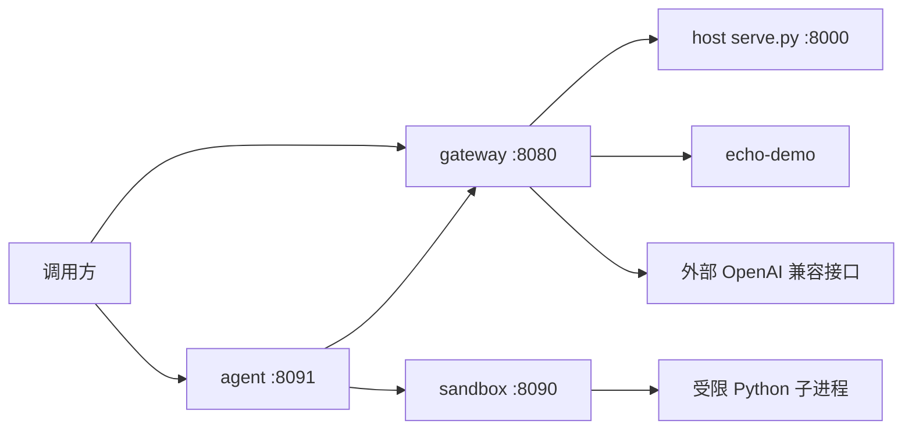

# Agent、沙箱与模型网关

在原有「训练 → 合并 → serve.py」之上增加三层运行时能力，可用 docker compose 一键拉起。



## 组件

| 服务 | 端口 | 作用 |
|---|---|---|
| gateway | 8080 | 多路由模型网关，OpenAI `/v1/chat/completions` |
| sandbox | 8090 | 无外网、只读根文件系统、内存/进程数限制的代码沙箱 |
| agent | 8091 | 工具循环：聊天 → `python_exec`/`calculator` → 最终回答 |
| serve.py | 8000 | 原本地微调模型，仍可在宿主机运行 |

沙箱只挂在 compose 的 `isolated` 内网，不能访问公网。网关和 Agent 同时连 `edge`（对外）和 `isolated`（调沙箱）。

## 启动

```powershell
wsl -d Ubuntu -- bash /mnt/d/llm_learning/llm-single-node/scripts/compose-up.sh
wsl -d Ubuntu -- bash /mnt/d/llm_learning/llm-single-node/scripts/test_stack.sh
```

默认 `echo-demo` / `agent-default` 不加载真实权重，用来验证网关、Agent 和编排是否通。

## 接到本地微调模型

1. 宿主机先启动原来的服务：`scripts/serve.sh outputs/cpu-smoke/merged`
2. 把 `configs/gateway.yaml` 里 `agent-default` 的 `type` 改成 `openai`，`upstream` 指向 `http://host.docker.internal:8000/v1`
3. `docker compose up -d --force-recreate gateway agent`

也可以继续给网关加路由，例如：

```yaml
  - id: cloud-small
    type: openai
    upstream: https://api.openai.com/v1
    api_key_env: OPENAI_API_KEY
    rewrite_model: gpt-4o-mini
```

请求时把 `model` 设成路由 `id`，网关会转发并把上游模型名改写成 `rewrite_model`。

## 本地不用 Docker 时

```bash
python -m single_node_llm.gateway --config configs/gateway.yaml --port 8080
python -m single_node_llm.sandbox --port 8090
GATEWAY_URL=http://127.0.0.1:8080/v1 SANDBOX_URL=http://127.0.0.1:8090 \
  python -m single_node_llm.agent --port 8091
```

## 安全边界

沙箱会做这些限制，但不是内核级 gVisor/Kata：

- `python -I` 隔离站点包
- 临时目录执行完即删
- Linux 下限制 CPU / 地址空间 / 打开文件数
- compose：`internal` 网络、`cap_drop: ALL`、`read_only`、`pids_limit`、`mem_limit`

不要把未审查的生产密钥或可写业务数据挂进沙箱容器。
