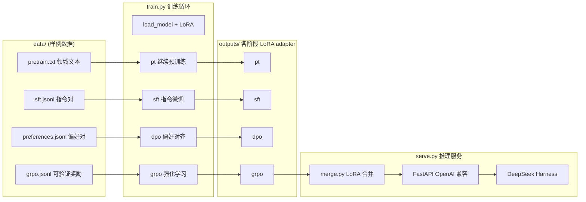
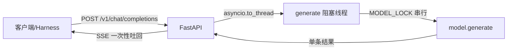

# 技术架构文档 — llm-single-node

> 本仓库是一个「单机大模型训练实验室」:把一个开源底座模型,依次经过**继续预训练 → SFT → DPO → GRPO → LoRA 合并**,最终以 **OpenAI 兼容 HTTP 接口**提供服务,并接入 DeepSeek Harness。
>
> 它的设计目标是**算法透明 + 单机可运行**——每一行损失代码都是手写的,方便学习,而不是替代 LLaMA-Factory / DeepSpeed / vLLM 这类生产级框架。

---

## 1. 项目定位

| 维度 | 说明 |
|---|---|
| 训练范式 | DAPT(领域继续预训练)→ SFT → DPO → GRPO |
| 参数效率 | 全程 LoRA(低秩适配),不训练全量参数 |
| 训练设备 | CPU(无 GPU 时)/ 单卡 CUDA,二选一 |
| 服务协议 | OpenAI Chat Completions 兼容(含流式) |
| 下游对接 | DeepSeek Harness(本地 agent 平台) |
| 明确边界 | 不做从零预训练、不支持多卡、不追求吞吐 |

### 为什么这样设计

- 消费级单机(8 vCPU / 24GiB / 无 GPU)放不下 7B 全量训练,LoRA + 小模型才能跑通。
- `pt` 是「领域继续预训练」,在已有底座上继续见领域文本;真正从零预训练需要自建 tokenizer、海量语料和多机集群。
- 手写循环是为了让你看得见每一步:损失怎么算、梯度怎么回传、DPO/GRPO 的公式长什么样。

---

## 2. 系统总览



**一次完整调用的链路**(以 `run_pipeline.sh configs/cpu-smoke.yaml` 为例):

```text
configs/*.yaml ──► common.load_config()
                        │
                        ▼
data/pretrain.txt  ──► train --stage pt    ──► outputs/<cfg>/pt/adapter
data/sft.jsonl     ──► train --stage sft   ──► outputs/<cfg>/sft/adapter
data/preferences.jsonl ─► train --stage dpo ──► outputs/<cfg>/dpo/adapter
data/grpo.jsonl    ──► train --stage grpo  ──► outputs/<cfg>/grpo/adapter
                                                    │
                                                    ▼
                        merge.py ──► outputs/<cfg>/merged (完整模型)
                                                    │
                                                    ▼
                        serve.py ──► http://127.0.0.1:8000/v1
                                                    │
                                                    ▼
                        start-harness.ps1 ──► http://127.0.0.1:3080 (Harness Web)
```

---

## 3. 目录结构与职责

```text
llm-single-node/
├── .gitignore               # 忽略 .venv/.venv-idea/outputs/.dsh-home/__pycache__/egg-info
├── README.md                # 使用入口文档
├── pyproject.toml           # 打包定义(src layout,可 pip install -e .)
├── configs/                 # 三套运行配置
│   ├── cpu-smoke.yaml       # SmolLM2-135M,1 step,冒烟验证链路
│   ├── cpu-local.yaml       # Qwen2.5-0.5B,20 steps,CPU 小实验
│   └── cuda-1.5b.yaml       # DeepSeek-R1-Distill-Qwen-1.5B,200 steps,需要 GPU
├── data/                    # 四个阶段的样例数据(正式使用请替换为真实脱敏数据)
│   ├── pretrain.txt         # pt: 每行一段领域文本
│   ├── sft.jsonl            # sft: {"messages":[{role,content}...]}
│   ├── preferences.jsonl    # dpo: {"prompt","chosen","rejected"}
│   └── grpo.jsonl           # grpo: {"prompt","required_terms":[],"require_json":bool}
├── harness/
│   └── settings.yaml        # DeepSeek Harness 本地 provider 配置模板
├── scripts/
│   ├── bootstrap.sh         # 建 venv + 装依赖 + 环境自检
│   ├── run_pipeline.sh      # 一键跑全流程 pt→sft→dpo→grpo→merge
│   ├── serve.sh             # 启动推理服务
│   ├── test_api.sh          # 服务冒烟(health/chat/stream)
│   └── start-harness.ps1    # 启动 Harness Web(Windows PowerShell)
├── outputs/                 # 训练产物(被 gitignore,不入库)
└── src/single_node_llm/     # 核心代码(见下)
```

### 核心包 `src/single_node_llm/` 模块职责

| 文件 | 职责 | 关键函数 |
|---|---|---|
| `common.py` | 公共设施:配置/模型/分词器加载、LoRA、批处理、logps 计算 | `load_config / load_model / load_tokenizer / save_adapter / pad_batch / completion_logps` |
| `train.py` | 四个训练阶段的全部算法逻辑 | `train_causal(pt/sft) / train_dpo / train_grpo / reward_completion` |
| `merge.py` | 把 LoRA adapter 合并回底座模型 | `main()` |
| `serve.py` | FastAPI 推理服务 + OpenAI 协议 + 工具调用解析 | `generate / parse_tool_calls / chat` |
| `preflight.py` | 环境探测(CPU/内存/CUDA),给出配置建议 | `main()` |

---

## 4. 配置体系

### 4.1 配置加载

`common.py:17` `load_config()` 用 `yaml.safe_load` 读配置,并把配置文件的绝对路径塞进 `_config_path`。配置即约定:模型的四套超参都在 YAML 里,改配置不用改代码。

### 4.2 配置字段速查

```yaml
model_name: Qwen/Qwen2.5-0.5B-Instruct   # 底座模型,HuggingFace 仓库名
output_root: outputs/qwen-0.5b           # 各阶段产物根目录
seed: 42                                 # 随机种子(训练可复现)
device: cpu                              # auto | cpu | cuda
dtype: float32                           # float32 | bfloat16 | float16(auto=有卡bf16/无卡fp32)
max_length: 384                          # 序列最大长度(超长左截断)

lora:                                    # LoRA 超参
  rank: 16                               #   低秩维度 r
  alpha: 32                              #   缩放系数(lora_alpha)
  dropout: 0.05
  target_modules: [q_proj, k_proj, ...]  #   注入的线性层

train:
  learning_rate: 0.0001                  # AdamW 学习率
  max_steps: 20                          # 优化器更新步数(不是 epoch)
  gradient_accumulation_steps: 2         # 梯度累积
  log_every: 1                           # 每 N 步打日志

dpo:
  beta: 0.1                              # 偏好对齐强度(温度系数)

grpo:
  beta: 0.02                             # KL 惩罚系数
  num_generations: 4                     # 每组采样数 G
  max_new_tokens: 48                     # 生成长度上限
  temperature: 0.9                       # 采样温度

gradient_checkpointing: true             # 显存优化(只有 cuda-1.5b.yaml 开了)
```

### 4.3 三套配置的定位

| 配置 | 模型 | 步数 | 适用场景 |
|---|---|---|---|
| `cpu-smoke.yaml` | SmolLM2-135M | 1 | 首次验证「链路通不通」,几分钟出结果 |
| `cpu-local.yaml` | Qwen2.5-0.5B | 20 | CPU 上做小规模实验,先确认 loss/内存/耗时 |
| `cuda-1.5b.yaml` | DeepSeek-R1-Distill-Qwen-1.5B | 200 | 有 NVIDIA 卡后的正经训练 |

---

## 5. 核心模块详解

### 5.1 `common.py` — 公共设施

**模型加载策略**(`load_model`, `common.py:74`):

```text
AutoModelForCausalLM.from_pretrained(model_name)
        │
        ├── 有 adapter_path? ──► PeftModel.from_pretrained(继续用之前 adapter)
        └── 没有 adapter_path 且要训练? ──► get_peft_model + LoraConfig (新建 LoRA)
        └── 只推理? ──► 裸底座模型
```

- 支持 `gradient_checkpointing`:开启后 `use_cache=False`,用「重算激活」换显存。
- 当前**没有** 4-bit bitsandbytes 量化(README 已注明升级 7B 时需补)。

**`completion_logps`**(`common.py:142`)是 DPO/GRPO 的核心工具:

```text
model(input_ids) → logits[:, :-1]
对每个 token: log_softmax 取标签 token 的 log 概率
用 prompt_lengths 做掩码:只统计「prompt 之后生成的 token」,忽略 prompt 部分
返回 (每个序列总 logps, 每个序列有效 token 数)
```

它统一了 DPO(比较 chosen/rejected 的 logp)和 GRPO(算生成内容的策略梯度)对概率的需求。

### 5.2 `train.py` — 训练算法

**`train_causal`**(pt / sft, `train.py:47`):
- pt:读 `data/pretrain.txt` 每行作为一段,直接 tokenize。
- sft:读 `sft.jsonl`,用 `apply_chat_template` 把 messages 拼成带角色的对话文本。
- 标准 **causal LM loss**:`model(input_ids, labels=input_ids)`,padding 位置把 label 置为 `-100`(Pytorch 交叉熵自动忽略)。
- AdamW + 手动梯度累积(累积 `gradient_accumulation_steps` 次 micro-step 才 `optimizer.step()`)。

**`train_dpo`**(`train.py:95`):
- 同时加载两份模型:**policy**(可训练)+ **reference**(冻结,`torch.no_grad`)。
- 每步取一条偏好记录,构造 chosen / rejected 两条样本,分别算 policy 与 reference 的 completion logps。
- 损失就是 **DPO 公式**:

$$\mathcal{L} = -\log\sigma\Big(\beta\big[(\log p_\theta(y_c)-\log p_{ref}(y_c))-(\log p_\theta(y_r)-\log p_{ref}(y_r))\big]\Big)$$

- 直观理解:让「优选答案相对参考模型的优势」大于「拒绝答案的优势」,`preference_accuracy` 就是这一步有没有满足这个排序。

**`train_grpo`**(`train.py:160`):
- 也带冻结 reference,目标是**通过采样 + 奖励去强化生成策略**。
- 每步:
  1. 对同一 prompt 用 `model.generate` 采样 `num_generations`(G)条回答;
  2. `reward_completion` 打分 → 组内标准化得到 **advantage**: `(r_i - mean(r)) / std(r)`;
  3. 算每条回答的 per-token logps,构造 KL 惩罚(近似形式 `exp(x)-x-1`);
  4. 损失 = `-(A * log_p - beta * KL)` 取平均,反向传播更新 LoRA。
- 这就是 DeepSeek 论文里 **GRPO 去掉 critic 模型、用组内基线** 的核心思想。

**`reward_completion`**(`train.py:142`)当前是规则式奖励:检查 `required_terms` 是否命中 + JSON 是否可解析。README 强调:正式场景应替换为更可靠的验证器(单测/编译器/JSON Schema/沙箱)。

### 5.3 `merge.py` — LoRA 合并

把「底座权重 + 最后的 adapter」用 `merge_and_unload()` 融成一个完整模型,写入 `outputs/<cfg>/merged`,供服务端直接加载。**合并是可选的部署步骤**,不合并也能用 PeftModel 推理。

### 5.4 `serve.py` — 推理服务

**架构**(`serve.py`):



关键实现点:

| 特性 | 实现方式 |
|---|---|
| 并发模型 | **无并发**:全局 `threading.Lock` 串行,一次一个请求 |
| 流式 | **伪流式**:先整体生成完,再一次性按 SSE 吐出(不是逐 token) |
| 上下文管理 | 读 `max_position_embeddings`,给生成预留长度;输入超限时 `truncation_side="left"` **从左侧截断**,优先保留最近的对话 |
| 工具调用 | 生成文本里用正则抽 `<tool_call>...</tool_call>` JSON 块,转成 OpenAI 的 `tool_calls` 结构 |
| 接口 | `/health`、`/v1/models`、`/v1/chat/completions`(支持 tools 与流式) |
| 协议 | 返回结构与 OpenAI 一致(`choices/usage/message`) |

**局限**(设计取舍,不是 bug):`MODEL_LOCK` 单路串行、无 KV 缓存复用、无批处理——这正是 vLLM 要解决的部分,详见 README 对比。但「能通 + OpenAI 兼容 + 支持工具调用」让 Harness 可以直接对接。

### 5.5 `preflight.py` — 环境自检

打印平台/Python/CPU/内存/torch/CUDA 信息,并根据有没有 GPU 推荐配置文件,`bootstrap.sh` 最后会自动跑一次。

---

## 6. 与生产级框架的关系

| 本工程 | 生产对应物 | 本工程替代了什么 / 缺什么 |
|---|---|---|
| `from_pretrained` 随手拉权重 | HuggingFace Hub / ModelScope / Wisemodel | 没锁 revision、没模型资产管理 |
| 手写训练循环 | LLaMA-Factory + DeepSpeed | 算法透明,但没有数据打包/多卡/断点/实验记录 |
| `MODEL_LOCK` 单路服务 | vLLM / Ollama | 能通但没有并发/吞吐/量化 |
| `preflight.py` + 冒烟脚本 | OpenCompass / Ragas | 只有环境自检,没有基准评测 |

一句话:本工程是「**从零到 OpenAI 接口的最小完整链路**」,工业栈是「**在每一环把规模、并发、管理能力补上**」。

---

## 7. 阅读路线图(推荐顺序)

> 按依赖顺序读,每读完一层都建议自己改一个参数跑一遍,理解立刻加深。

1. **`README.md`** — 先看整体目标和边界,建立心智模型。
2. **`configs/cpu-smoke.yaml`** — 认识配置字段,这是所有行为的「输入」。
3. **`data/` 四个文件** — 认识四个阶段的输入数据长什么样。
4. **`common.py`** — 公共设施,重点是 `load_model`(LoRA 怎么挂)和 `completion_logps`(概率怎么算)。
5. **`train.py`** — 按 `train_causal → train_dpo → train_grpo` 顺序读,对照上文公式看代码。
6. **`merge.py`** — 10 行,理解「adapter → 完整模型」。
7. **`serve.py`** — 理解服务协议、上下文截断、工具调用解析。
8. **`scripts/*`** — 最后看脚本,把所有环节串起来。

**阅读技巧**:训练循环很短(每阶段 ~40 行),建议边读边在草稿纸上写:输入什么 → 算出什么 loss → 反传什么梯度。GRPO 那段如果卡住,先只看「采样→奖励→advantage→损失」四步,不要纠结 KL 的推导。

---

## 8. 术语表

| 术语 | 含义 |
|---|---|
| DAPT | Domain-Adaptive Pretraining,领域继续预训练,在底座上继续见领域文本 |
| SFT | Supervised Fine-Tuning,用指令-回答对监督微调 |
| LoRA | 冻结底座权重,只训练注入的低秩增量矩阵,参数量级小 |
| DPO | Direct Preference Optimization,用偏好对直接算损失对齐,无需奖励模型 |
| GRPO | Group Relative Policy Optimization,组内相对优势 + KL 约束,无需 critic |
| reference model | 冻结的参考模型,用于 DPO/GRPO 计算与当前策略的偏离 |
| advantage | 组内标准化后的奖励:`(r - mean)/std`,GRPO 的策略梯度权重 |
| adapter | LoRA 增量权重(几 MB),可与底座合并或单独保存 |
| KL 惩罚 | 约束策略别偏离参考模型太远,防训练崩溃 |
